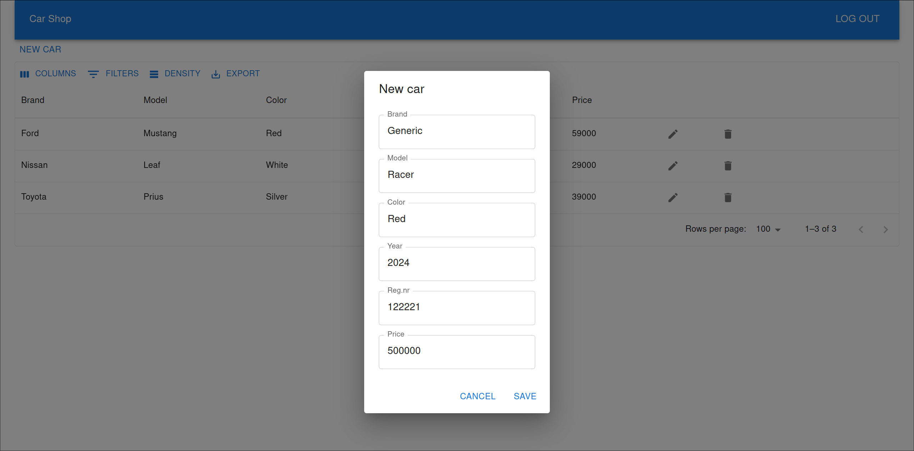

# Carsale
Carsale is a car inventory management system. It provides store owners easy interface to add new cars, view list of cars with search and filter functions, and remove cars when sale is made. 

# Quick start 
## Front-end 
- change `.env` file to use the back-end url
- `npm install`
- `npm run dev`

## Back-end
- Need to have a running instance of Mariadb. Modify `application.properties` file with the connnection details of the database.
- `./gradlew bootRun`